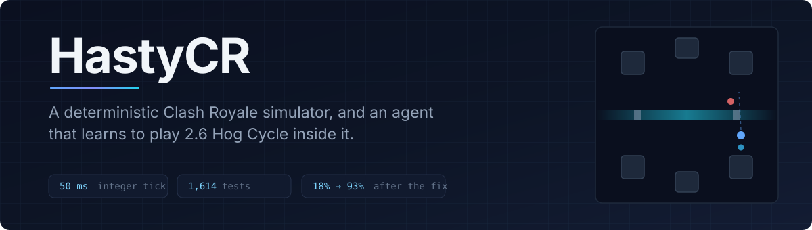
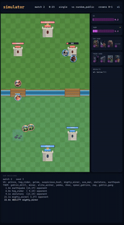
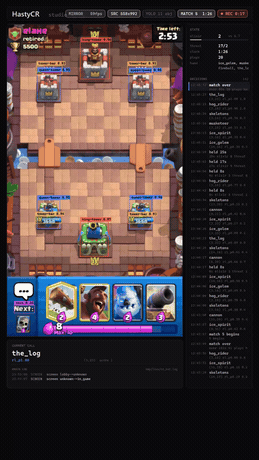
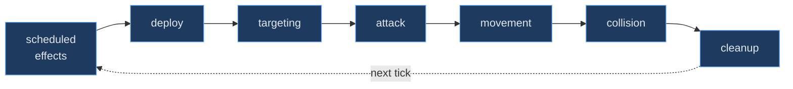
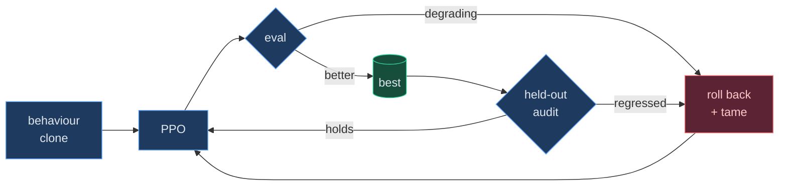

<div align="center">



<br><br>


<br>

**A Clash Royale battle engine you can trust to the millitile, an agent that learns inside it, and a bridge that puts what it learned into the real game.**

<br>

[**Showcase**](#showcase) · [**Install**](#install) · [**The simulator**](#1-the-simulator) · [**Training**](#2-training-an-agent) · [**Evaluation**](#3-evaluation) · [**Live play**](#4-playing-the-real-game) · [**Calibration**](#5-calibration) · [**Architecture**](#architecture) · [**Results**](#results) · [**Limits**](#known-limitations)

</div>

<br>

---

<br>

## Showcase

<table>
<tr>
<td width="50%" align="center">

<a href="docs/assets/simulator-showcase.mp4"></a>

### The simulator

Two policies fighting on the integer engine. Same seed, same match, every time — down to the tick a projectile lands on.

```bash
python -m sim.watch
```

<sub><a href="docs/assets/simulator-showcase.mp4"><b>▶ full video</b></a></sub>

</td>
<td width="50%" align="center">

<a href="docs/assets/bot-showcase.mp4"></a>

### The same policy, live

Vision reads the emulator, the trained network picks the card and the tile, taps go back to the device. None of the plays are scripted.

```powershell
.\run.ps1 -Brain rl -Checkpoint <path>
```

<sub><a href="docs/assets/bot-showcase.mp4"><b>▶ full video</b></a></sub>

</td>
</tr>
</table>

<br>

---

<br>

## Install

```bash
git clone https://github.com/hastylmao/Hasty-CR.git
cd Hasty-CR
pip install -e ".[dev]"          # simulator, trainer, tests
```

```bash
python -m pytest tests -q        # confirm the engine is behaving
```

> [!NOTE]
> `[dev]` is enough for everything except driving a real device. Live play additionally needs `[live]`, an Android emulator and a GPU — see [Playing the real game](#4-playing-the-real-game).

<br>

---

<br>

## 1. The simulator

A complete battle: towers, troops, buildings, spells, projectiles, deploy timers, elixir, card cycle, targeting, pathing, collision and death effects. Positions are **integer millitiles** (1 tile = 1000) and time advances in fixed **50 ms** ticks, so there is no floating-point drift and a seed reproduces a match exactly — which is what makes any measurement here worth reading.

Card statistics are decoded from the game client's own tables (`SightRange`, `HitSpeed`, `LoadTime`, `DeployTime`, …), not transcribed from a wiki.

### Watch a match

```bash
python -m sim.watch
```

| flag | what it does |
|---|---|
| `--opponent brain\|simple\|scripted\|random` | who the other seat plays as |
| `--seed 8000 --matches 1` | one exactly reproducible match |
| `--speed 2 --fps 60` | run faster than real time |
| `--skin debug --rings` | flat diagram, plus every unit's hitbox and attack radius |
| `--random-decks` | sample two 8-card decks from all resolvable cards |
| `--record out.mp4` | write the match to a file |

<details>
<summary><b>Why <code>--skin debug --rings</code> is the one that matters</b></summary>

<br>

The game skin is for showing people. The debug skin is for finding out you were wrong.

It drops the arena art and draws each unit's *actual* collision radius and attack range as rings. The body-block deadlock — a 1-elixir Skeleton stopping a Hog Rider permanently — was invisible under the game skin and obvious the moment the rings went on: the Hog's ring was touching, its target ring was not, and it simply stood there.

</details>

### Run matches in bulk, with no renderer

```bash
python -m sim.batch --matches 200 --workers 8 --opponent brain
```

Parallel, headless, deterministic per seed. This is what every win-rate number in this README came out of.

### Ask the engine what it predicts

```bash
python -m sim.check
```

Prints concrete, checkable claims — *"a lone Hog Rider on an undefended princess tower gets 6 hits in (1902 damage) before dying"*, *"a Musketeer walking into a Cannon wins after 7.1 s, untouched"*. Take them into a real match. Where the game disagrees, **the simulator is the one that is wrong**, and that is the whole point of printing them.

### Probe specific mechanics

```bash
python scripts/probe_mechanics.py
```

Card cycle enforcement, building pull radius, lane commitment, elixir economy — each printed with the measurement next to the expectation.

<br>

---

<br>

## 2. Training an agent

The agent sees the board as stacked spatial planes and chooses from **2,321 masked actions** (`1 + 4 × 576`: pass, or one of four hand slots onto one of 576 legal tiles). Illegal actions are masked before the softmax, so the policy cannot spend elixir it does not have or place a card where the game would refuse it.

### Step 1 — clone the rule engine

```bash
python -m sim.clone --episodes 4000 --epochs 8 --name clone
```

PPO from random initialisation on a 2,321-action space explores for a very long time before it stumbles into a win. Starting from a behaviour clone of the hand-written policy skips that entirely.

### Step 2 — PPO

```bash
python -m sim.train_ppo --envs 8 --steps 2000000 --init runs/clone/clone.pt \
    --opponent meta --brain-share 0.5 --value-warmup 300000
```

<details>
<summary><b>Every flag that matters, and what it is compensating for</b></summary>

<br>

| flag | why it exists |
|---|---|
| `--init` | Start from the clone. Without it, see above. |
| `--value-warmup 300000` | The clone trains **only** the action head, so it arrives with a good policy and a *random* value head. PPO advantages are returns minus values, so the first updates are noise scaled by a garbage critic. Three runs regressed a 75% clone to 35% before this was found. |
| `--target-kl 0.02` | PPO's clip bounds the ratio per action, not the distance travelled across 4 epochs × 4 minibatches. A clone starts at top-1 probability 0.99; sixteen unbounded steps per rollout is enough to walk it off a cliff. |
| `--opponent meta\|brain\|simple\|mirror` | Who to train against. |
| `--brain-share 0.5` | **The one that is not optional.** Of the non-self-play episodes, the fraction against the rule engine rather than meta decks. |
| `--entropy --entropy-final --entropy-anneal` | Explore-then-exploit schedule on the entropy bonus. |
| `--crown --win --chip --elixir` | Reward weights. |
| `--envs --rollout` | Parallel environments and rollout length. |

**On `--brain-share`:** training against a single opponent produces a policy that beats *that opponent* and nothing else. Measured, both directions:

| trained against | vs rule engine | vs meta decks |
|---|---|---|
| meta decks only | **16.7%** | 82.5% |
| 50/50 mix | **93.3%** | 86.7% |

A number that looks like success on one axis was near-total failure on the other. The mix is what makes the result mean anything.

</details>

### Step 3 — let it supervise itself

```bash
python scripts/rl_supervisor.py --hours 6 --envs 8 --init runs/clone/clone.pt
```

Long unattended runs fail in a way that looks identical to working: the run keeps going, the numbers keep printing, and the policy at the end is worse than the one it started from. The supervisor watches **behaviour, not loss** — hog share, plays per match, score drift — because those move long before a win rate does. On a trigger it stops, rolls back to the last verified-loadable checkpoint, tames a hyperparameter and restarts.

<br>

---

<br>

## 3. Evaluation

Nothing here is trusted until it has been measured against opponents it never trained on, on held-out seeds.

| | command |
|---|---|
| **Score one checkpoint** against every opponent | `python scripts/evaluate_pilot.py --ckpt <path> --episodes 60 --all` |
| **Compare two checkpoints** on the same deck and seeds | `python scripts/head_to_head.py --a <old> --b <new> --games 100` |
| **Hunt for degenerate strategies** | `python scripts/exploit_probe.py --ckpt <path> --episodes 60` |

<details>
<summary><b>What the exploit probe is for</b></summary>

<br>

A policy that has found a simulator bug scores brilliantly and is worthless. The probe looks for the shape of that: wins that depend on one card, one tile, or one timing; win rates that collapse when a single parameter is perturbed. A strategy that only works against this engine is a bug report, not a result.

</details>

<br>

---

<br>

## 4. Playing the real game

> [!CAUTION]
> Automating Clash Royale is against Supercell's Terms of Service and can get an account banned. Treat this half of the project as a learning exercise, not a ladder tool.

Needs `pip install -e ".[live,dev]"`, an Android emulator (MuMu, at 1080×1920) and a CUDA GPU.

The same trained network drives it. Vision reads the screen, the observation is assembled into **the same planes the simulator produces**, the policy picks an action, and taps go back to the device.

```powershell
.\run.ps1 -Brain rl -Checkpoint checkpoints\...\best.pt -Matches 5
```

| flag | what it does |
|---|---|
| `-Brain rl\|rules` | the trained network, or the hand-written policy |
| `-NoQueue` | never press Battle — **for a friendly 1v1**, you start the match and it plays whatever it finds itself in |
| `-FullRes` | keep the emulator at native 1080×1920 instead of dropping to 540×960 for capture speed. Slower per decision; use it when the run is going into a video |
| `-Vision yolo\|buildabot` | the detector trained here (0.959 mAP50), or the upstream one |
| `-Matches N` / `-Forever` / `-Stop` | how long to run |

### The studio

```powershell
.\studio.ps1
```

The emulator mirrored at 60 fps next to the bot's own decisions, in a portrait canvas sized for Shorts and Reels. It is strictly read-only — frames from the window, state from tailing the log — so opening or closing it cannot disturb a live match.

`R` record · `S` still · `L` labels · `D` detector · `F` fullscreen · `Q` quit

<details>
<summary><b>Does the live bot use an LLM to decide plays?</b></summary>

<br>

**No.** In `-Brain rl` there is no language model anywhere in the decision path — it is the trained network and nothing else. The local advisor can only reweight candidates that a *rule engine* produced, and in `rl` mode there is no rule engine to produce them, so it is not consulted at all.

</details>

<br>

---

<br>

## 5. Calibration

The part that keeps the simulator honest: record what the real game does, replay it against the engine, and measure where they diverge.

```bash
python scripts/fidelity.py list                    # what can be checked
python scripts/fidelity.py compare --help          # engine vs recording
python scripts/fidelity.py report                  # where they disagree, ranked
```

Every approximation that has not been measured out is written down rather than quietly left in — see [`docs/`](docs/) and [Known limitations](#known-limitations).

<br>

---

<br>

## Architecture


**The dotted line is the load-bearing one.** `sim/env.py` defines the observation and action space; `scripts/brain/rl_policy.py` has to mirror it exactly. Get it wrong and nothing throws — the policy just receives a subtly different world than the one it trained in and plays badly for reasons no log will explain. `tests/test_rl_policy.py` exists solely to catch that.

<details>
<summary><b>Inside a tick</b> — seven phases, 50 ms each</summary>

<br>



**50 ms is not a guess.** Every timing field in the client data is a multiple of 50, so that is the game's own granularity. A finer tick would only interpolate between values that never land off those boundaries.

Phases run in a fixed order and each emits a normalized event, so a whole match can be replayed and diffed against a recording of the real game.

</details>

<details>
<summary><b>The training loop</b> — and why it needs a supervisor</summary>

<br>



</details>

<br>

---

<br>

## Results

<table>
<tr><th align="left">policy</th><th align="right">vs rule engine</th><th align="right">vs meta decks</th><th align="right">crown differential</th></tr>
<tr><td>behaviour clone <sub>(starting point)</sub></td><td align="right">18.3%</td><td align="right">78.3%</td><td align="right">−0.62</td></tr>
<tr><td><b>trained</b> <sub>6.1M steps</sub></td><td align="right"><b>93.3%</b></td><td align="right"><b>86.7%</b></td><td align="right"><b>+0.78</b></td></tr>
</table>

<sub>60 held-out matches per opponent · fixed seed · greedy actions · opponents never trained against. Wilson intervals on the rule-engine axis do not overlap.</sub>

> [!NOTE]
> **These numbers predate the lane-commitment fix and are being re-measured.**
> Until that commit, a unit whose own princess tower had fallen walked at the *far lane's* tower instead of the king, because the engine picked the nearest tower by straight-line distance. So this policy learned its after-you're-up-a-tower play against a board that does not exist. Opening play is unaffected; the closing behaviour is not trustworthy, and neither is any part of the figure above that depends on it. The table will be replaced with a measurement on the fixed engine rather than quietly left standing.

> [!IMPORTANT]
> **This is the simulator marking its own homework.** No trained policy has beaten a human. One match played by a person found the pathing bug above that thirty million training steps never did — which is the honest measure of what a simulated win rate is worth.

<br>

---

<br>

## Repository layout

| path | what's in it |
|---|---|
| [`sim/`](sim/) | the engine, arena, entities, spells, projectiles, PPO trainer, vectorised envs |
| [`scripts/`](scripts/) | live runner, rule engine, RL bridge, studio, training supervisor |
| [`tools/`](tools/) | calibration, emulator capture, replay comparison |
| [`tests/`](tests/) | one file per behaviour, each named for the failure it prevents |
| [`docs/`](docs/) | decision logs — start with `RL_SPRINT4_DECISIONS.md` |

<br>

---

<br>

## Known limitations

> [!WARNING]
> Listed because a simulator you trust blindly is worse than one you don't.

- **The body-block cost is uncalibrated.** A cheap unit stepping in front of a Hog delays it ~0.5 s. Contact used to stop it *permanently*, which made cheap-body defence unbeatable — and is why every earlier policy hoarded cheap cards and never learned to Fireball. The fix is right in shape; the magnitude is judgement, not measurement.
- **Charging units still deadlock.** A Battle Ram is held indefinitely by one Knight — kept as a strict `xfail` so it cannot be quietly forgotten. Prince, Dark Prince and Ram Rider share it. No 2.6 card charges, which is the only reason it hasn't blocked anything.
- **Live vision cannot read hit points.** A detected unit contributes its card's full HP, so a half-dead Musketeer looks healthy to the policy.
- **Eight named calibration approximations remain**, each written down in [`docs/`](docs/) rather than left implicit.

<br>

---

<div align="center">
<br>

Deck archetypes and the style-classification rule adapted from [vegetableleaf/ClashAI](https://github.com/vegetableleaf/ClashAI) · no upstream implementation copied · [`research/REFERENCE_LICENSES.md`](research/) records every project inspected.

**MIT** licensed. Clash Royale is a trademark of Supercell, who are not affiliated with this project and have not endorsed it.

<br>
</div>
