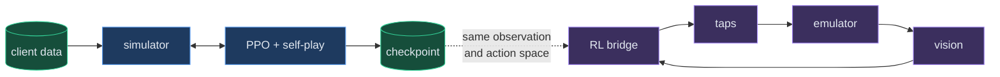
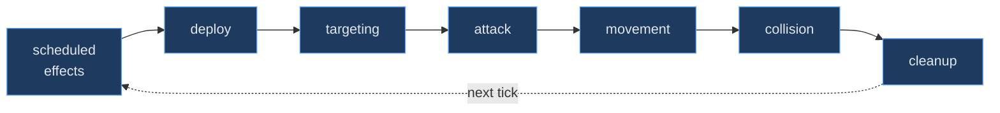
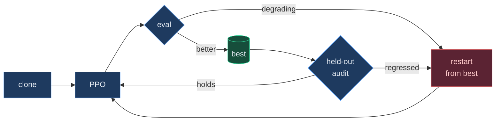

<div align="center">


<br>


</div>

<br>

A full Clash Royale battle engine — towers, troops, spells, projectiles, pathing, collision — running on integer millitile arithmetic, so a seed reproduces a match **exactly**. On top of it sits a PPO agent that learns 2.6 Hog Cycle by self-play, and a bridge that puts the trained policy into the real game through an emulator.

Card stats are decoded from the game client's own tables, not scraped from a wiki.

<br>

## Results

<table>
<tr><th align="left">policy</th><th align="right">vs rule engine</th><th align="right">vs meta decks</th><th align="right">crown diff</th></tr>
<tr><td>behaviour clone <sub>(start)</sub></td><td align="right">18.3%</td><td align="right">78.3%</td><td align="right">−0.62</td></tr>
<tr><td><b>trained</b> <sub>6.1M steps</sub></td><td align="right"><b>93.3%</b></td><td align="right"><b>86.7%</b></td><td align="right"><b>+0.78</b></td></tr>
</table>

<sub>60 held-out matches per opponent · fixed seed · greedy actions · opponents never trained against. Confidence intervals on the rule-engine axis do not overlap.</sub>

> [!IMPORTANT]
> **This is the simulator marking its own homework.** No trained policy has beaten a human. One match played by a person found a physics bug that thirty million training steps had not — which is the honest measure of what a simulated win rate is worth.

<br>

## Architecture



The dotted line is the one that matters. The simulator and the live bridge must agree on the board **exactly** — a silent mirror there is the most expensive bug this project has had, so tests assert both produce identical planes for the same match.

<br>

<details>
<summary><b>Inside the tick loop</b> — seven phases, 50 ms each</summary>

<br>



**50 ms is not a guess.** Every timing field in the client data — `HitSpeed`, `LoadTime`, `DeployTime` — is a multiple of 50, so that is the game's own granularity. A finer tick would only interpolate between values that never land off those boundaries.

Phases run in a fixed order and each emits a normalized event, so a whole match can be replayed and compared against a recording of the real game.

</details>

<details>
<summary><b>The training loop</b> — and why it needs a supervisor</summary>

<br>



Every previous failure looked identical from the outside: the run keeps going, the numbers keep printing, and the policy at the end is worse than the one it started from. So the supervisor watches **behaviour, not loss** — hog share and plays-per-match move long before a win rate does.

The opponent mix is not decoration. Training against one opponent produces a policy that beats *that opponent*: an all-meta diet measured 82.5% against meta decks and **16.7%** against the rule engine; the reverse arrangement gave 93.3% and 76.7% the other way round.

</details>

<br>

## Quick start

```bash
pip install -e ".[dev]"        # simulator + trainer + tests
python -m pytest tests -q      # 1,614 tests
python -m sim.watch            # watch it play itself
```

```bash
python -m sim.train_ppo --envs 8 --steps 2000000 --init <checkpoint>
python scripts/rl_supervisor.py --hours 6 --opponent brain
```

<details>
<summary><b>Against the real game</b> — needs an emulator</summary>

<br>

```powershell
pip install -e ".[live,dev]"
.\run.ps1 -Brain rl -Checkpoint <path> -Matches 5
.\run.ps1 -Brain rl -Checkpoint <path> -NoQueue    # friendly 1v1: you start the match
.\studio.ps1                                        # mirror, decisions, log feed
```

Trained weights are not in the repository — they are 231 MB each. Train your own, or grab one from Releases.

</details>

<br>

## Layout

| | |
|---|---|
| `sim/` | engine · arena · entities · spells · projectiles · PPO trainer · vec env |
| `scripts/` | the live runner, the rule engine, the RL bridge, the studio, the supervisor |
| `tools/` | calibration, emulator capture, replay comparison |
| `docs/` | decision logs — start with `RL_SPRINT4_DECISIONS.md` |
| `tests/` | one file per behaviour, named for the failure it prevents |

> [!TIP]
> Two seams matter. `sim/env.py` defines the observation and action space; `scripts/brain/rl_policy.py` must mirror it exactly. Change one without the other and it fails *silently* — `tests/test_rl_policy.py` exists to catch that.

<br>

## Known limitations

> [!WARNING]
> Listed because a simulator you trust blindly is worse than one you don't.

- **The body-block cost is uncalibrated.** A cheap unit stepping in front of a Hog delays it ~0.5 s. Contact used to stop it *permanently*, which made cheap-body defence unbeatable and is why earlier policies hoarded cheap cards and never learned Fireball. The fix is right in shape; the magnitude is judgement, not measurement.
- **Charging units still deadlock.** Battle Ram is held indefinitely by one Knight — a strict `xfail` so it cannot be quietly forgotten. Prince, Dark Prince and Ram Rider share it. No 2.6 card charges.
- **Live vision cannot read hit points**, so a detected unit contributes its card's full HP. A half-dead Musketeer looks healthy to the policy.
- **Eight named calibration approximations remain** — see `docs/`.

<br>

---

<div align="center">
<sub>

Deck archetypes and the style-classification rule adapted from [vegetableleaf/ClashAI](https://github.com/vegetableleaf/ClashAI) · no upstream implementation copied · `research/REFERENCE_LICENSES.md` records every project inspected

**MIT** licensed · Automating Clash Royale breaks Supercell's Terms of Service and can get an account banned — treat the live-play parts as a learning exercise. Clash Royale is a trademark of Supercell, who are not affiliated with this project.

</sub>
</div>
